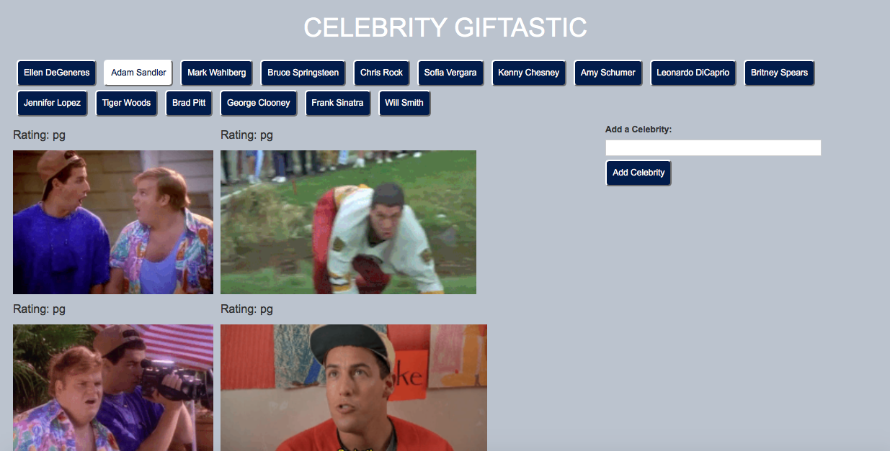

# GifTastic

## Overview

GIPHY API to make a dynamic web page that populates with gifs of your choice. To finish this task, you must call the GIPHY API and use JavaScript and jQuery to change the HTML of your site.

A dynamic web application that utilizes the GIPHY API to populate gifs of celebrities of the user's choice. JavaScript and jQuery is used to update the HTML.

## Experience the App

* View the app: [GitHub Pages Link](https://nicolelcarvalho.github.io/GifTastic/)

## Illustration

## Tech Used
- HTML
- CSS
- GIHPY API
- JavaScript / jQuery

## Built With

* Sublime Text - Text Editor